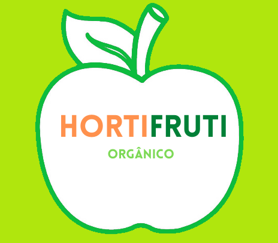
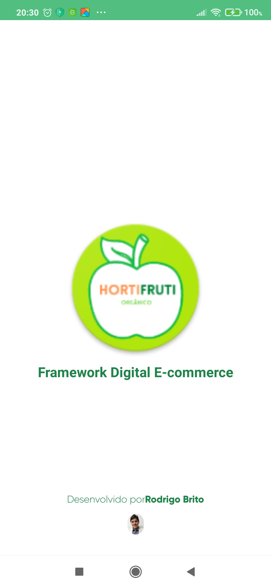
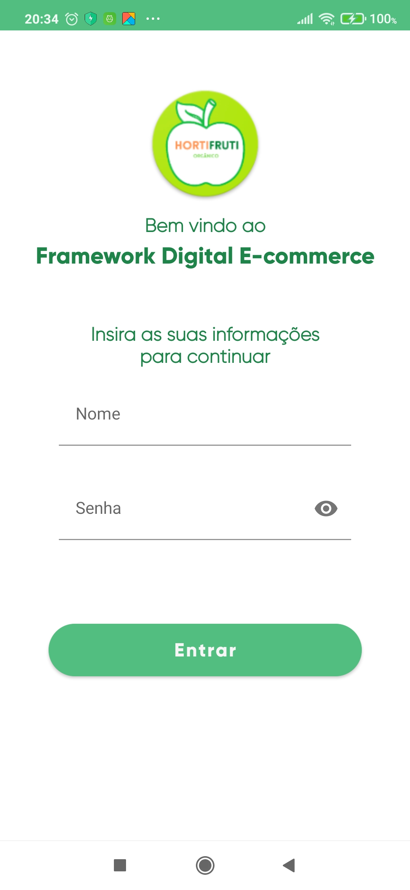
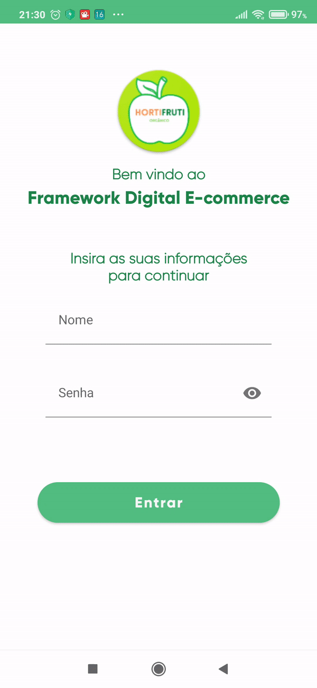
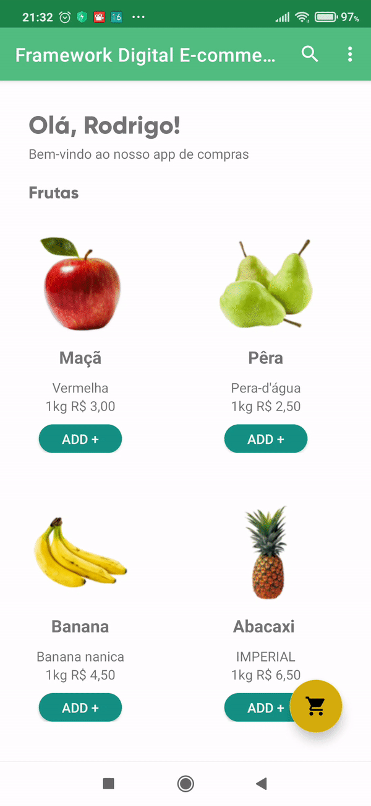
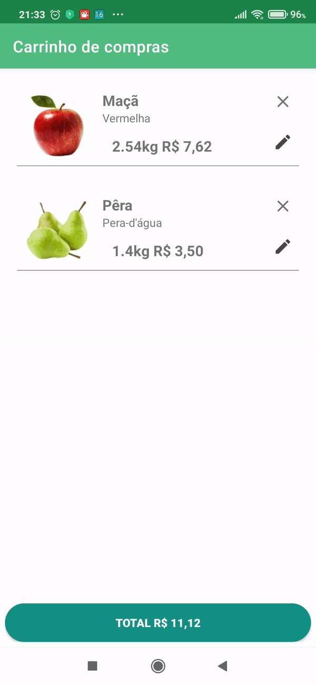

# FrameworkDigitalEcommerce
Desafio para vaga de desenvolvedor mobile Android

 

    

  <h3 align="center">Hortifruti Orgânico - Desafio Framework Digital</h3>

  

   Aplicação feita para o desafio da Framework Digital
     
  

## Sumário

* [Sobre o Projeto](#sobre-o-projeto)
* [Objetivos](#objetivos)
* [Início do Projeto](#início-do-projeto)
* [Telas](#telas)
  * [Login](#login)
  * [Tela Inicial](#tela-inicial)
  * [Carrinho de compras](#carrinho)
* [Arquitetura](#arquitetura)
  * [Resumo](#resumo)
* [Injeção de dependências](#Injecaodedependencias)
* [Bibliotecas Usadas](#bibliotecas-usadas)
* [Contato](#contato)

## Sobre o projeto

O desafio consiste em desenvolver um aplicativo na plataforma Android usando Kotlin, seguindo alguns padrões como **MVVC**.
\
         

## Objetivos

* Desenvolver um app, tipo e-commerce, para vender maçã, pêra, banana, abacaxi e manga;
* O cliente deve realizar o login;
* O cliente poderá pesquisar pelo produto e escolher aquele que quer comprar;
* Deve existir um carrinho de compras onde será listado os produtos que o cliente selecionou;
* Deve possuir um botão checkout (gerar um pdf como se fosse um comprovante).
* O desafio deve ser desenvolvido utilizando Android (Kotlin).

## Início do Projeto

Primeiro criei a logo, utilizando canvas, para representar o aplicativo:
 

## Telas

Em seguida, pensei no design das telas e no fluxo de navegação, usando conceitos de UI/UX e seguindo as regras do [Material Design](https://example.com):

### Login
Tela para o usuário inserir o seu nome e senha que será usado para simular um login.
Ambas as informações são validadas antes de ser passado para a próxima tela:
\

### Tela Inicial
A tela principal do aplicativo exibe a lista de frutas disponíveis. Podendo ser feito uma busca pelo nome da fruta na lista.
\

\
Ao selecionar o botão Add + um Dialog é aberto e o usuário pode digitar a quantidade em kg do produto selecionado.
\

### Carrinho de compras

O Floating Button abre a tela de carrinho de compras onde serão listados todos os produtos adicionados na tela principal e fazendo o cálculo para o valor total da compra.
\

\
Ao selecionar o botão com o valor total um recibo é gerado em PDF.
\

## Arquitetura
A arquitetura usada no projeto é a **Model View ViewModel - MVVM** + **Room**, onde dentro da aplicação as camadas são divididas em *Model*, *View* e *ViewModel* e persistência de dados utilizando o padrão DAO

### Resumo

1. **Model:** Lógica envolvida nos domínios da aplicação (Product, Cart)
2. **View:** Toda construção de telas, a camada de apresentação.
3. **ViewModel:** Coordena as operações entre a View e a camada Model.

## Injeção de dependências

Para injeção de dependências foi usada o **Koin**, para que de forma automática seja injetado os módulos do *ViewModel*, *Repositório* ...

  
  
## Bibliotecas Usadas

Algumas bibliotecas externas foram usadas para ajudar no desenvolvimento:

* [Rounded Image View](https://github.com/vinc3m1/RoundedImageView) - Imageview com bordas arredondadas.
* [Glide](https://github.com/bumptech/glide) - Usada para inserir imagens com qualidade em Imageview.
* [iText PDF](https://itextpdf.com/en) - Usada para geração de PDFs.
* [Room](https://developer.android.com/jetpack/androidx/releases/room) - Usado para armazenar dados no banco de dados

## Contato

Rodrigo Brito - rodrito90@gmail.com

Link do Projeto: [https://github.com/rodrigobn/FrameworkDigitalEcommerce](https://github.com/rodrigobn/FrameworkDigitalEcommerce)
